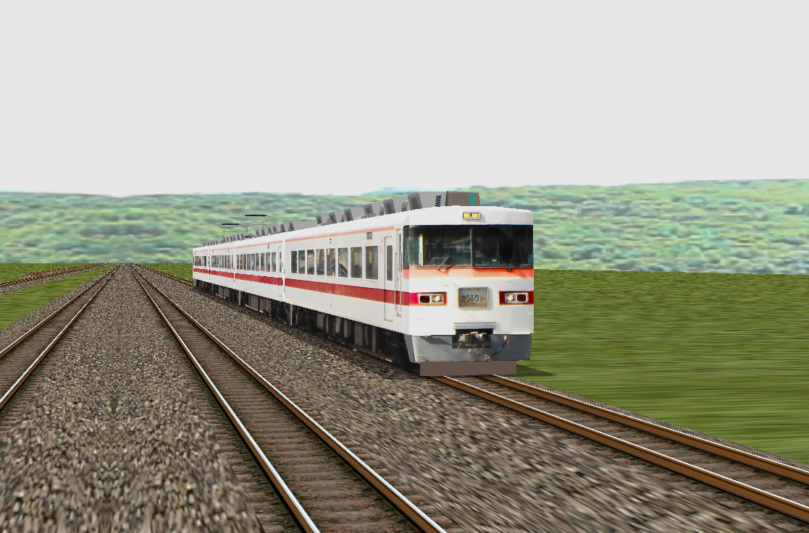
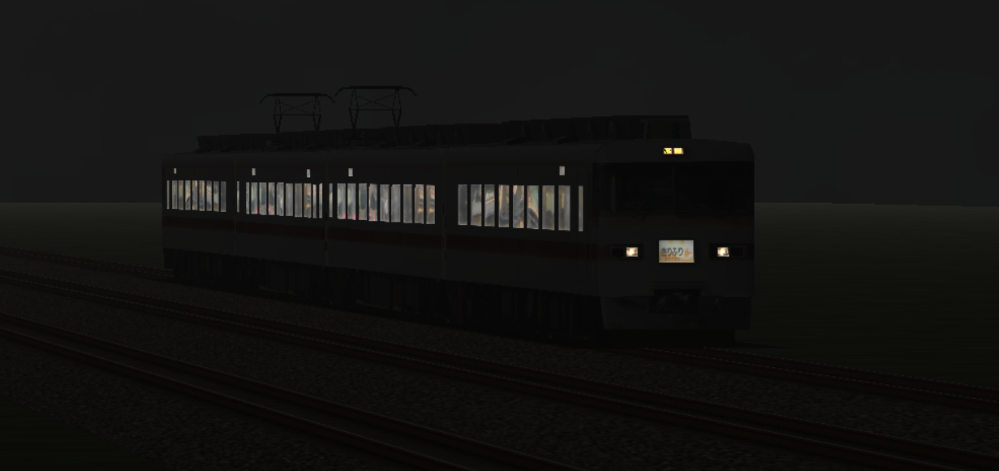

# 東武350型ストラクチャセット    (発光対応)

東武350型のストラクチャセットです。 
モデルは352編成ですが、**完全に実車を再現したわけではない**ので悪しからず。 
(頑張れば300型も作れるかも...?)

このストラクチャはBVE-trainsim5/6用に制作されたものです。 
BVE5/6での使用に関しては本文書の利用条件の下でご自由にお使いいただけます。 
なお、本データの著作権は放棄しておりません。フリー素材ではございませんのでご注意ください。 
また、BVE以外での使用は固くお断りいたします。 

## 利用条件
1.トラブル防止のため、改造/無改造に問わずデータを公開する際にReadMeへ”本データを使用した旨、**明記**をお願い致します。 
2.**無改造での単体配布は認めません。** 
3.改造の上での単体配布に関しては、事前にご相談ください。 
4.改造・無改造での路線組み込みに関しては連絡不要でご自由にお使いいただけます。 
5.**BVE-trainsim5/6以外の他ゲームへの転用・転載は固く禁じます。** 

※そのほか不明な点がありましたら、下の連絡先にご連絡ください。 
※また、必要であれば、mqozファイルの提供(現状渡し)も可能です。ご連絡ください。

## お借りしたデータ
### 内房線プロジェクト様(BVE Trainsim 内房線)
roof_01.dds

 ※これ以外のデータの著作権はなーくるるに帰属します。

## 編成について
浅草方を先頭にしています。(東武基準上り列車) 
※351L.pngと354L.pngを差し替えることで進行方向を入れ替えられます。 
行先等を変更する場合は、〇〇〇L.pngを編集してください。
## イメージ

夜間発光イメージ

### 更新履歴
ver1.0(2026/5/9)

***
作:なーくるる(aizu.pj.1987@gmail.com) 
© 2026 なーくるる
***
